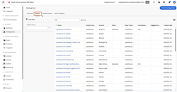

# Overview

Learn how to get the most out of Adobe Journey Optimizer B2B Edition. Orchestrate account and buying group journeys using built-in generative AI and industry-leading automation to maximize demand for specific offerings.

>[!NOTE]
>
>More videos coming soon!

## What's new {#whats-new}

* [Buying groups overview](/help/buying-groups/buying-groups-overview.md)
_Learn all about buying groups and how to utilize them._

* [Create a buying group](/help/buying-groups/create-a-buying-group.md)
_Learn how to use an account audience, a role template, and a solution interest to create buying groups._

* [Solution interest](/help/buying-groups/solution-interest.md)
_Learn about buying group solution interests and how to configure/use them when creating a buying group._

## Most popular videos {#most-popular-videos}

<table>
<tr>
<td>

<a href="/help/buying-groups/buying-groups-overview.md"><strong>Buying groups overview</strong></a>

</td>
<td>

<a href="/help/buying-groups/create-a-buying-group.md"><strong>Create a buying group</strong></a>

</td>
<td>

<a href="/help/buying-groups/role-templates.md"><strong>Role templates</strong></a>

</td>
</tr>
</table>
