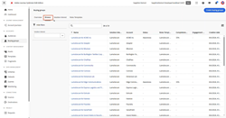
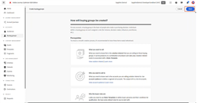
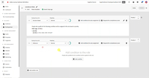

# [!DNL Journey Optimizer B2B Edition] Tutorials

Learn how to get the most out of [!DNL Journey Optimizer B2B Edition]. Orchestrate account and buying group journeys using built-in generative AI and industry-leading automation to maximize demand for specific offerings.

## What's new {#whats-new}

* [Buying group stages](/help/main/buying-groups/buying-group-stages.md)
_Learn how to create multiple buying group lifecycle stages within a single stage model and specify the transition rules._

* [Listen for AEP events](/help/main/account-journeys/journey-nodes/listen-for-aep-events.md)
_Define and use any experience event in your account journey._

* [Paid media orchestration](/help/main/account-journeys/journey-nodes/paid-media-orchestration.md)
_Learn how to use a journey to move people into an external audience, which you can then push to any supported paid media destination in the AEP destination catalog._

## Most popular videos {#most-popular-videos}

<table>
<tr>
<td>

<a href="/help/main/buying-groups/buying-groups-overview.md"><strong>Buying groups overview</strong></a>

</td>
<td>

<a href="/help/main/buying-groups/create-a-buying-group.md"><strong>Create a buying group</strong></a>

</td>
<td>

<a href="/help/main/buying-groups/role-templates.md"><strong>Role templates</strong></a>

</td>
</tr>
</table>
